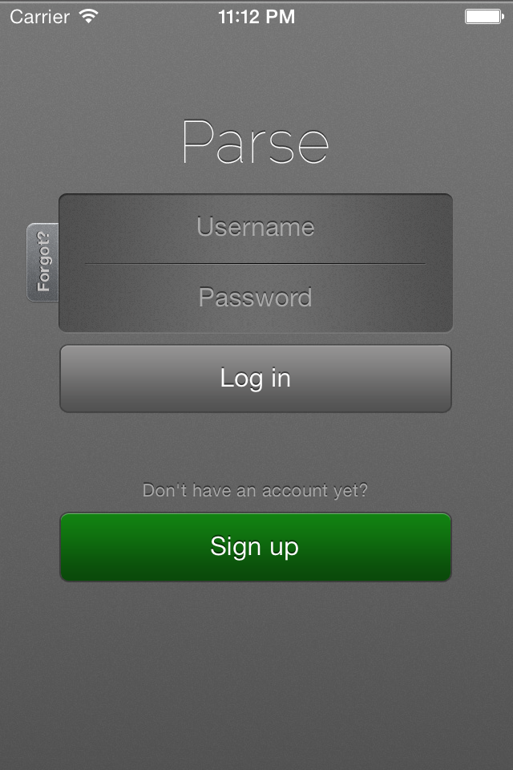
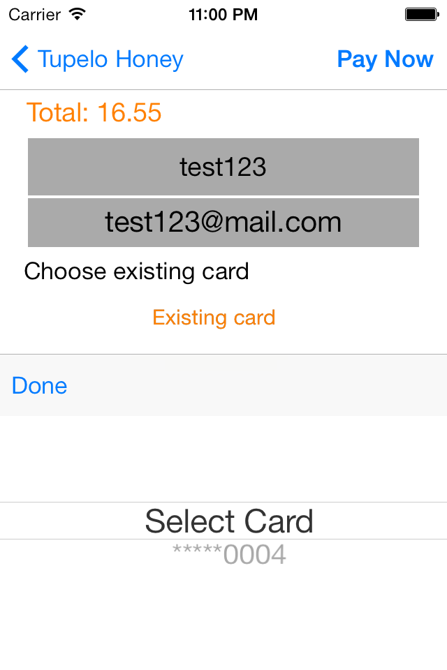

# Honey Store Tutorial 
*Returning (1-click)  Payments with PAYMILL for iOS*

PAYMILL is a full-stack payment solution with very reasonable pricing and is easy to setup. This example shows you, how to add it to an iOS application. For backend we use [Parse](https://parse.com). For an example implementation without a backend take a look at [VoucherMill](https://github.com/paymill/paymill-ios/tree/master/samples/vouchermill)


### Description

The application, which we are going to implement, is a simple store that sells jars of honey ;) Let's take a look...


First step is for the user to login or register in the HoneyStore Application.



There are four different products that the user can choose from.


When the user selects on one of the products, he will be redirected to the details page, where he can read more about his choice and purchase it.


On the checkout page the user has to provide a credit card, if none exists.


He can scan it, or he can enter the requested information manually.


If the user has previously entered a credit card, he can just select it.



### Architecture

Unlike the VoucherMill application, we want to create transactions from our backend. This way we can also save the credit card information for our user, so he doesn't need to re-enter it when making subsequent purchases. Note, that this is the preferred way to use PAYMILL on mobile devices.

The application flow is:

1. When a user registers for the application, we create a corresponding [client](https://www.paymill.com/en-gb/documentation-3/reference/api-reference/#document-clients) object. 
2. When a user the reaches checkout, we query the PAYMILL Rest API for existing [payment](https://www.paymill.com/en-gb/documentation-3/reference/api-reference/#document-payments) objects and show them in a list.
3. The user can then:
 1. select an existing payment. In this case we send the 'pay_XXX' Id to our backend and create the transaction with it.
 2. choose to enter a new credit card. In this case we use the [iOS SDK](https://github.com/paymill/paymill-ios) to create a [token](https://www.paymill.com/en-gb/documentation-3/reference/paymill-bridge/). Then we send the token to our backend and create the transaction with it and the 'client_XXX' id, associated with our user. By using the client Id we make sure, that the payment object will appear in the list of payments next time.
 
### Quick start

1. Register accounts for the following services:
 * [PAYMILL](https://www.paymill.com) We have to locate our public and private keys as explained in the [brief instructions](https://www.paymill.com/en-gb/documentation-3/introduction/brief-instructions/).
 * [Parse](https://parse.com/) We have to create an application and get the application keys.
 * [card.io](https://www.card.io/) We login into our account and create an app token.
2. Install the Parse command line tool, as described [here](https://parse.com/docs/cloud_code_guide)
3. Setup the Parse application locally: 

 ```dos
   $ parse new HoneyStore
 
  Email: your_email@mail.com
  Password:your_password
  1:HoneyStore
  Select an App: 1

  $ cd HonneyStore
```
4. Copy the contents of the [Parse folder](Parse/) in your application's *cloud* folder.
5. Open *cloud/main.js* and replace *PAYMILL_PRIVATE_KEY* with your private key from PAYMILL.
6. Deploy the Parse application to the cloud:

 ```dos
   parse deploy
```
7. Deploy the initial database (replace with your own application keys) in [Parse folder](Parse/) folder:


 ```dos
    curl -X POST -H "X-Parse-Application-Id: APPLICATION_ID"  -H "X-Parse-REST-API-Key: APPLICATION_REST_API_KEY" -H "Content-Type: application/json"  --data-binary @productDB.json https://api.parse.com/1/batch
```

8. Install [CocoaPods](http://cocoapods.org/)
9. Prepare the project and dependencies:

 ```dos
  pod install
```
10. Open the xcworkspace project.
11. Locate the file *PMLPaymentViewController* and enter your card.io app token and PAYMILL public key.
12. Locate the file *PMLDefaultViewController* and enter your Parse application keys.


### Setting up the backend

For a backend we use Parse. After the registration we have to create an application (e.g.'HoneyStore'). More information about the cloud code is available in the Parse [documentation](https://parse.com/docs/cloud_code_guide).

In our cloud code directory *cloud*, we need 3 files: 
* productDB.js : this is the seed file for our product database (honey jars), located in the [Parse folder](Parse/).
* main.js : this file includes the business logic of the backend application, located in the [Parse folder](Parse/).
* paymill.parse.js : this is the PAYMILL JS Wrapper, which simplifies the development with PAYMILL. Please download the latest release from the [github repository](https://github.com/paymill/paymill-js) of the project.

We have to enter our PAYMILL private key in the main.js file:

```javascript
  paymill.initialize("PAYMILL_PRIVATE_KEY");
```

It is important to understand, that the PAYMILL private key gives  access to all functions of the PAYMILL Rest API, including refunds. That is the reason why we call the API from Parse and not directly from within the iOS App - to not expose our private key.

We can now open a terminal and execute following command, which will deploy our cloud code on the Parse servers.

```dos
   parse deploy
```

Once the cloud code is deployed we can execute the following command, to fill our database with the pre-defined honey jars:

```dos
    curl -X POST \
      -H "X-Parse-Application-Id: APPLICATION_ID" \
      -H "X-Parse-REST-API-Key: APPLICATION_REST_API_KEY" \
      -H "Content-Type: application/json" \
      --data-binary @productDB.json \
      https://api.parse.com/1/batch
```
We can locate our application keys at *[Application Name]->Settings->Application Keys*. 

### Setting up the iOS app

For dependency management we use the de-facto standard in iOS: **CocoaPods**. 
*Honey Store* depends on the following libraries:
* [CardIO](https://github.com/card-io/card.io-iOS-SDK) - We use card.io for credit card scanning.
* [Parse](https://parse.com/) - simplifies the connection with our backend (Parse) and includes built-in login / registration screens and logic.
* [PAYMILL iOS SDK](https://github.com/paymill/paymill-ios) - We use the SDK to create a payment token from the user's credit card information.

Before we start, we must install **CocoaPods**, please read how to install it on http://cocoapods.org/.

After successful installation, we need to locate the *Honey Store* pod file and run the following command:
```objective-c
  pod install
```

As you can see **CocoaPods** prepares our project file and downloads all dependencies. After everything is complete, we are ready to go. Open the xcworkspace file and you will see the main project *Honey on Sale* .


### Application internals

#### User management 

For easy and fast implementation of the user management we use the built-in functions of the Parse iOS SDK. There are ready to use Login, SignUp controllers and views, which saves us hours of coding. You can find more about the built in Parse user management in [this](https://parse.com/tutorials/login-and-signup-views) tutorial.

When the application starts we check if there is an active user:

```objective-c
  if (![PFUser currentUser])
```
If there is no active user we use the Parse *PFLogInViewController* for a login screen (on this screen there is also the functionality to SignUp). When the user creates an account, it automatically calls our backend and saves the new user in our database. As we need to associate a PAYMILL client with our new user, we use a the *beforeSave* hook in our cloud code. We create a client in PAYMILL and assign it's id to our new user, as shown below:

```javascript
Parse.Cloud.beforeSave("_User", function(request, response) {
  paymill.clients.create(request.object.email, request.object.username).then(function(result) {
     request.object.set("paymillClientId", result.id);
     response.success();
  }, function(e) {
    response.error("save user failed" + e);
  });
});
```

#### Listing the products 

In our database we have 4 products. To show them in our store we make a request to Parse. When the user logs in, we make following call in *PMLStoreController*. 


```objective-c
- (void)getProductsWithComplte:(ControllerCompleteBlock)complete{

  PFQuery *query = [PFQuery queryWithClassName:@"Product"];
    if(self.products == Nil){
        self.products = [[NSMutableArray alloc] init];
    }
    [self.products removeAllObjects];

  [query findObjectsInBackgroundWithBlock:^(NSArray *objects, NSError *error) {
    for (PFObject *obj in objects) {
            PMLProduct* product = [PMLProduct parse:obj];
            [self.products addObject:product];
        }
        complete(error);
  }];
}
```
The code pulls all products from the Parse database and saves them as PMLProduct in-memory.

#### iOS view controllers

Our iOS application has 5 view controllers:

* PMLDefaultViewController: This is main controller of our application, on this controller we decide if there is active user, or ask user to SignIn.
* PMLCheckoutViewController: This is the base class for our view controllers, for example PMLProductDetailsViewController and PMLStoreViewController .
* PMLStoreViewController: In this view controller we are dealing with the products that a user can buy. It is a simple table controller with pre-defined cells. 
* PMLProductDetailsViewController: In this view we show detailed information about the selected product.
* PMLPaymentViewController: This is the actual checkout.


#### Payment: entering a new credit card

Once the user selects his honey jar, he goes to the *PMLPaymentViewController*. Here we use another very useful library: card.io. card.io allows the user to scan his credit card with the camera of his device. This saves him a lot of time and is less error prone. 

Before we can use card.io, we must register on their [website](https://www.card.io/) and create an app token. We enter our token as shown below:

```objective-c
 #define CARDIO_TOKEN @"CARD_IO_TOKEN"
```
To receive the credit card info our controller must implement the *CardIOPaymentViewControllerDelegate* @protocol.
After all the data is entered we proceed to send the data to PAYMILL and get payment token.

```objective-c
- (void)createTransactionForAccHolder:(NSString *)ccHolder cardNumber:(NSString*)cardNumber
                          expiryMonth:(NSString*)expiryMonth
                           expiryYear:(NSString*)expiryYear cardCvv:(NSString*)cardCvv{
    PMError *error;
    PMPaymentParams *params;
    // 1. generate paymill payment method
    id paymentMethod = [PMFactory genCardPaymentWithAccHolder:ccHolder
                                                   cardNumber:cardNumber
                                                  expiryMonth:expiryMonth
                                                   expiryYear:expiryYear
                                                 verification:cardCvv
                                                        error:&error];
    if(!error) {
        // 2. generate params
        params = [PMFactory genPaymentParamsWithCurrency:self.currency amount:[self.amount intValue]
                                             description:self.description error:&error];
    }

    if(!error) {
        // 3. generate token
        [PMManager generateTokenWithPublicKey:PAYMILL_PUBLIC_KEY
                                     testMode:YES method:paymentMethod
                                   parameters:params success:^(NSString *token) {
                                       //token successfully created
                                       [self createTransactionWithToken:token];
                                   }
                                      failure:^(PMError *error) {
                                          //token generation failed
                                          NSLog(@"Generate Token Error %@", error.message);
                                          [MBProgressHUD hideAllHUDsForView:self.view animated:YES];
                                      }];
    }
    else{
        [MBProgressHUD hideAllHUDsForView:self.view animated:YES];
        NSLog(@"GenCardPayment Error %@", error.message);
    }
}
```

*Important!* We should never send the actual credit card information to our server, as this will require our server to be PCI compliant.

First, we need to generate a *PMPaymentMethod* object. It represents the credit card information. We also need a  *PMPaymentParams*  object; it contains the amount, currency and description for the transaction. Then, we call the *generateTokenWithPublicKey* method, which sends the information to the PAYMILL bridge and returns a token. This token is valid for 5 minutes and can be used only one time. 

To create the actual transaction we call *createTransactionWithToken* on Parse (executed in the cloud). 

```objective-c
- (void)createTransactionWithToken:(NSString*)token {

    NSMutableDictionary *parameters = [[NSMutableDictionary alloc] init];
    [parameters setObject:token forKey:@"token"];
    [parameters setObject:self.amount forKey:@"amount"];
    [parameters setObject:self.currency forKey:@"currency"];
    [parameters setObject:self.description forKey:@"descrition"];

    [PFCloud callFunctionInBackground:@"createTransactionWithToken" withParameters:parameters
                                block:^(id object, NSError *error) {
                                    if(error == nil){
                                        [self transactionSucceed];
                                    }
                                    else {
                                        [self transactionFailWithError:error];
                                    }
                                    [MBProgressHUD hideAllHUDsForView:self.view animated:YES];
                                } ];

}
```

#### Payment: Handling old credit cards

Each time a user makes a purchase, we create a PAYMILL transaction. The PAYMILL server will also create a [Payment](https://www.paymill.com/en-gb/documentation-3/reference/api-reference/#document-payments) object and associate it with a [Client](https://www.paymill.com/en-gb/documentation-3/reference/api-reference/#document-clients). As described earlier, we can use the payment object to create another transaction with the same credit card information, without having the user re-enter it.

In our cloud code we have a method to get all previous payments:

```javascript
Parse.Cloud.define("getPayments", function(request, response) {
	Parse.Cloud.useMasterKey();
	var clientId = Parse.User.current().get("paymillClientId");
	paymill.clients.detail(clientId).then(function(client) {
		response.success(client.payment);
	}, function(error) {
		response.error("couldnt list payments:" + error);
	});
});
```
Note, that we use the user's PAYMILL client Id to retrieve only the payment objects that belong to him.


We get the list of the user's payment objects in the method *getOldPayments* and show them in the *PMLPaymentViewController*.
When the user selects one of these payments, we only need to send the payment Id and amount to PAYMILL to create the transaction.

```objective-c
- (void)createTransactionWithPayment:(NSString*)paymentId
{
    NSMutableDictionary *parameters = [[NSMutableDictionary alloc] init];
    [parameters setObject:paymentId forKey:@"paymillPaymentId"];
    [parameters setObject:self.amount forKey:@"amount"];
    [parameters setObject:self.currency forKey:@"currency"];
    [parameters setObject:self.description forKey:@"descrition"];
    [PFCloud callFunctionInBackground:@"createTransactionWithPayment" withParameters:parameters
                                block:^(id object, NSError *error) {
                                    if(error == nil){
                                        [self transactionSucceed];
                                     }
                                    else {
                                        [self transactionFailWithError:error];
                                    }
                                    [MBProgressHUD hideAllHUDsForView:self.view animated:YES];
                                } ];

}
```

